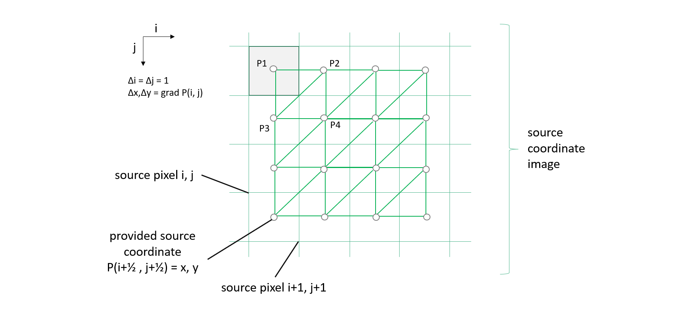
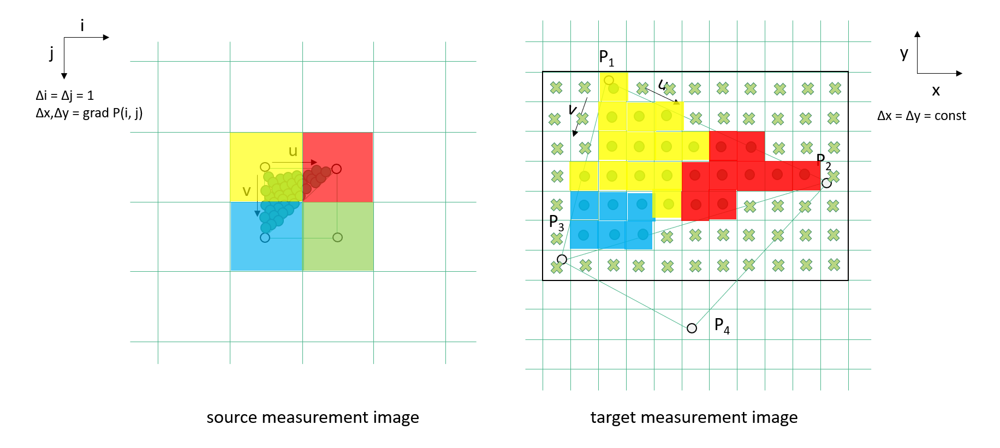
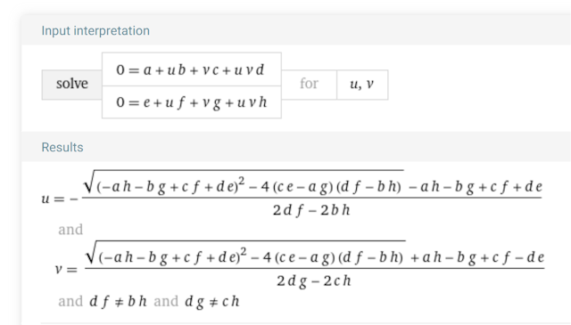

## Example of applying rectification to a Sentinel-3 OLCI scene

One example where rectification is often applied, is Sentinel-3 products. 
The following figure shows a Sentinel-3 OLCI Level-1b scene in its original 
satellite perspective. In addition to the measured reflectances, the data 
product also provides the latitude and longitude for each pixel as two 
individual coordinate images. To the right, the absolute value of the 
gradient vectors of the latitude and longitude  *|(∇ lon)² + (∇ lat)²|* 
are shown:  

The given coordinates, latitude and longitude, are *terrain corrected* with 
respect to a digital elevation model (DEM) that approximates the Earth's true fractal
surface. Therefore, the gradient vectors are not monotonically varying over the scene, 
instead they represent the roughness of the DEM. Areas of high 
surface roughness are indicated by the red circles in the figure above.
The figure below should explain the cause of the effect. 

A *rectification* is the transformation of satellite imagery from its original 
viewing geometry into a target geometry that forms a regular grid in a defined 
coordinate reference system (CRS) with uniform spatial resolution for each 
pixel in each dimension. For the Sentinel-3 OLCI Level-1b scene above, the
rectified measurement image for the geographic projection (CRS EPSG:4326) 
is shown here:

## Algorithm Description

The input to the rectification algorithm is satellite imagery in satellite 
viewing perspective. In addition, two images – one for each spatial 
dimension – provide the terrain corrected spatial coordinates.
Thus, for each source pixel we have a given spatial coordinate pair *x,y*,
which is assumed to refer to a source image pixel's center at *i+½,j+½*. 
The expected algorithm input is:

* *N* source measurement images;
* *2* source coordinate images (one for each spatial dimension) 
  comprising terrain corrected coordinates *x,y* in units of the CRS
  for each pixel *i,j*;

The output produced by the algorithm is 

* *N* target measurement images generated from source measurement images
  by projection.
* Target image geometry given as pixel size *Δx=Δy* and the coordinate 
  offset of the upper left target image pixel *x0,y0*. Pixel size and 
  offsets are given in units of the CRS.    
* *2* target lookup images (one for each spatial dimension) 
  comprising fractional source pixel coordinates *i+½+u*, *j+½+v* 
  (explained below);

In the following, the CRS of the target and source is assumed to be the same.
This is not a limitation, see [remarks](#remarks) below.

While the gradient of the coordinate images, *Δx* and *Δy* per pixel, is 
generally not constant in the source image geometry, we demand that the
target pixel size *Δx = Δy = const* for all pixels in the generated target 
images.

A fast and simple algorithm to perform the rectification is to visit each
source pixel *i,j*, collect the spatial coordinates *P = x,y*, span
two triangles between four adjacent coordinates,
*(P1, P2, P3)* and *(P2, P4, P3)*, and "paint" fractional source pixel
coordinates into a new target lookup image. The lookup image can than be used 
to retrieve the pixel values from a source measurement image for a given pixel
of the corresponding target measurement image, either by nearest 
neighbor lookup or by interpolation. 

The true Earth surface is unknown in between any given coordinates 
points *P(i+½, j+½)* and its neighborhood, and there is no defined "best guess" 
for any point *P(i+u, j+v)* with *0 ≤ u ≤ 1* and *0 ≤ v ≤ 1*. Hence, 
we use triangulation for its simplicity so that any in-between *P* is 
found by triangular interpolation.

From the coordinates *(P1, P2, P3)* of the first source triangle, the bounding
box in pixel coordinates in the target image can be exactly determined, 
because the target grid is regular, *P = x0 + i Δx, y0 - j Δy*, for each 
target pixel *i,j*, target pixel size *Δx,Δy*, and *x0,y0* being the 
coordinates of the upper left pixel at *i=½, j=½*. Given *P* and the plane
given by *(P1, P2, P3)* the parameters *u, v* can be computed from
triangular interpolation form *P = P1 + u (P2 – P1) + v (P3 – P1)*. 
If *0 ≤ u ≤ 1, 0 ≤ u ≤ 1, u+v ≤ 1*, then *P* is a point within the 
triangle.

At the same time, *u* and *v* are the fractions of source pixel
coordinate, *i + ½ + u* and *j + ½ + v*, which will be both stored in two 
target lookup images.

After all source pixels have been processed, the resulting target lookup 
images containing the fractional source pixel indexes, *i + ½ + u* 
and *j + ½ + v*, can be used to efficiently map a source measurement image 
*V* into the target measurement image. The pixel values of the source
measurement image are given as *V1 = V(i, j)*, *V2 = V(i+1, j)*,
*V3 = V(i ,j+1)*, and *V4 = V(i+1, j+1)* here and
are represented by different colour values, e.g., measurements such 
as radiances, reflectances, or higher level data variables:

In the simplest case, as shown above, a nearest neighbor lookup is performed 
to determine the pixel value *V* for the target measurement image according 
to:

*V = V2 if u > ½; V3 if v > ½; V1 else*  

The fractions *u, v* can also be used to perform the triangular interpolation 
between the three adjacent source measurements pixels. Note that the *u, v* 
were found from the three coordinate pairs that formed the original source 
triangle:

*V = VA + u (V2 − V1) + v (V3 − V1)*  

Using bilinear interpolation between the four adjacent source 
measurements pixels also takes the fourth source coordinate *P4* into account:

*V = VA + v (VB − VA)*  

with

*VA = V1 + u (V2 − V1)*  
*VB = V3 + u (V4 − V3)*  

## Remarks

**(1)** The target pixel size should be less or equal the source 
pixel size, so that triangle patches in the source refer to multiple pixels 
in the target image.
However, if the target pixel size is distinctly smaller than the source pixel size, 
and the source has a low spatial resolution, results will be inaccurate, 
as curved source pixel boundaries need to be taken into account for 
many projections.

**(2)** If the target pixel size is greater than the source pixel size, target 
bounding boxes refer to single source pixels only.
However, if the target pixel size is distinctly larger than the source pixel size, 
a prepended down-sampling or convolution of source images should be taken into 
account, e.g., using a Gaussian filter. Note, the algorithm can also be easily 
adapted to aggregate values of source pixels that refer to same target pixels.  

**(3)** The algorithm description assumes that the source CRS and target CRS be
the same. Different reference systems can be easily and efficiently supported 
by initially transforming each coordinate *P(i, j) = (x, y)* in the 
source coordinate images into the desired target CRS, i.e., 
*P_new = transform_coord(P, CRS_S, CRS_T)*.

**(4)** If *x, y* are decimal longitude and latitude, and the north or south poles 
are in the scene, than the algorithm will fail. One can get around this problem
by transforming source coordinates into a another suitable CRS first
or by transforming longitude values *x* into complex numbers and optionally
normalizing latitudes *y* to the same range from -1 to +1:

*x' = cos(x) + i sin(x)*  
*y' = 2y / π*  

**(5)** The algorithm can be rewritten to use bilinear surface patches comprising 
the adjacent four coordinates *(P1, P2, P2, P4)* instead of two triangles.
The bilinear interpolation between the four coordinates is

*PA = P2 + u (P2 − P1)*  
*PB = P3 + u (P4 − P3)*  
*P = PA + v (PB − PA)*  

Given that *P* is a known point on that surface the above can be rewritten as the two 
equations in *u* and *v*

*0 = a + u b + v c + u v d*  
*0 = e + u f + v g + u v h*

with the solutions for *u* and *v* (from Wolfram|Alpha¹):

and with the differences

*a = P1.x − P.x*  
*b = P2.x − P1.x*  
*c = P3.x − P1.x*  
*d = P4.x − P3.x*  
*e = P1.y − P.y*  
*f = P2.y − P1.y*  
*g = P3.y − P1.y*  
*h = P4.y − P3.y*  

¹ Wolfram Alpha LLC, 2024. Wolfram|Alpha. https://www.wolframalpha.com/input?i2d=true&i=0+%3D+a+%2B+u+*+b+%2B+v+*+c+%2B+u+*+v+*+d%5C%2844%29+0+%3D+e+%2B+u+*+f+%2B+v+*+g+%2B+u+*+v+*+h+for+u%5C%2844%29+v 
(access April 8, 2024).
