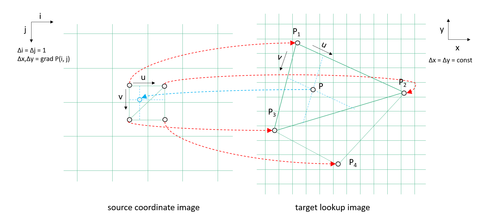
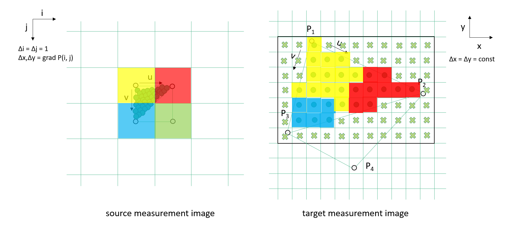

# User Guide for xcube-resampling

**xcube-resampling** provides algorithms for representing a dataset in a different grid
mapping. It supports:

- Simple resampling via affine transformation  
- Reprojection between coordinate reference systems (CRS)  
- Rectification of non-regular grids to regular grids  

All resampling methods are built around the [`GridMapping`](api.md/#xcube_resampling.gridmapping.GridMapping)
class, which represents a spatial grid mapping and contains all necessary information
for resampling.  

We first introduce the `GridMapping` class before explaining the three resampling
algorithms.

---

## `GridMapping` – the grid mapping object

A `GridMapping` describes the spatial structure of a dataset. It stores metadata such
as the coordinate reference system (CRS), spatial resolution, bounding box, spatial
dimensions, coordinates, and tile size (for chunked datasets).

Grids can be defined in two ways:

- **1D coordinates** – regular grids defined by evenly spaced x/y or lat/lon axes.  
- **2D coordinates** – irregular grids where each pixel has its own pair of x/y or 
  lat/lon coordinates.

### Creating a `GridMapping` object

There are three main ways to create a `GridMapping` instance:

#### 1. Regular grid mapping

Use [`GridMapping.regular`](api.md/#xcube_resampling.gridmapping.GridMapping.regular):

```python
from xcube_resampling.gridmapping import GridMapping

gm = GridMapping.regular(size, xy_min, xy_res, crs)
```

Parameter descriptions can be found [here](api.md/#xcube_resampling.gridmapping.GridMapping.regular).

#### 2. Create a grid mapping from an existing dataset

Use the [`GridMapping.from_dataset`](api.md/#xcube_resampling.gridmapping.GridMapping.from_dataset)
method:

```python
from xcube_resampling.gridmapping import GridMapping

gm = GridMapping.from_dataset(ds)
```
Here, `ds` is a `xarray.Dataset`. Further optional parameters can be found [here](api.md/#xcube_resampling.gridmapping.GridMapping.from_dataset).
> **Note:** If no grid mapping is provided for the input dataset, the resampling functions 
> use this method to derive one.

#### 3. Create a grid mapping from coordinates 
Use the [`GridMapping.from_coords`](api.md/#xcube_resampling.gridmapping.GridMapping.from_coords)
method:

```python
from xcube_resampling.gridmapping import GridMapping

gm = GridMapping.from_coords(x_coords, y_coords, crs)
```
Here, `x_coords` and `y_coords` are `xarray.Array` instances, and `crs` is the 
coordinate reference system (CRS). Further details of the parameters can be found
[here](api.md/#xcube_resampling.gridmapping.GridMapping.from_dataset).

#### Derive new `GridMapping` instances

You can create new grid mappings from existing ones using:

- [derive](api.md/#xcube_resampling.gridmapping.GridMapping.derive): 
  change selected properties.
- [scale](api.md/#xcube_resampling.gridmapping.GridMapping.scale): 
  create a scaled version of a regular grid mapping.
- [to_regular](api.md/#xcube_resampling.gridmapping.GridMapping.derive):
  convert an irregular grid mapping to a regular one.
- [transform](api.md/#xcube_resampling.gridmapping.GridMapping.transform):
  change the CRS of a grid mapping (regular → irregular with 2D coordinates).

An examples is available in the [Example Notebooks](examples/coords.ipynb).

---

### Resampling Algorithms

The function [`resample_in_space`](api.md/#xcube_resampling.spatial.resample_in_space)
integrates all three resampling algorithms and automatically selects the most
appropriate one:

| Algorithm             | Function                                                                                                                      | Selection Criteria                                                                                   |
|-----------------------|-------------------------------------------------------------------------------------------------------------------------------|------------------------------------------------------------------------------------------------------|
| **Affine Transformation** | [`affine_transform_dataset`](api.md/#xcube_resampling.affine.affine_transform_dataset) | Source and target grids are both regular and share the same CRS.                                    |
| **Reprojection**      | [`reproject_dataset`](api.md/#xcube_resampling.reproject.reproject_dataset)         | Source and target grids are both regular but have different CRS.                                  |
| **Rectification**     | [`rectify_dataset`](api.md/#xcube_resampling.rectify.rectify_dataset)               | 	Source grid is irregular with 2D coordinates.                                            |

With `resample_in_space`, users do **not** need to worry about selecting the right
algorithm—the function determines and applies it automatically.

#### Common parameters for all resampling algorithms

| Parameter       | Type / Accepted Values | Description | Default                                                                     |
|-----------------|------------------------|-------------|-----------------------------------------------------------------------------|
| `variables`     | `str` or iterable of `str` | Name(s) of variables to resample. If `None`, all data variables are processed. | `None`                                                                      |
| `interp_methods`| `int`, `str`, or `dict` mapping var/dtype to method. Supported:<br>• `0` — nearest neighbor<br>• `1` — linear / bilinear<br>• `"nearest"`<br>• `"triangular"`<br>• `"bilinear"` | Interpolation method for upsampling spatial data variables. Can be a single value or per-variable/dtype mapping. | `0` for integer arrays, else `1`                                            |
| `agg_methods`   | `str` or `dict` mapping var/dtype to method. Supported:<br>`"center"`, `"count"`, `"first"`, `"last"`, `"max"`, `"mean"`, `"median"`, `"mode"`, `"min"`, `"prod"`, `"std"`, `"sum"`, `"var"` | Aggregation method for downsampling spatial data variables. | `"center"` for integer arrays, else `"mean"`                                |
| `recover_nans`  | `bool` or `dict` mapping var/dtype to `bool` | Enable NaN recovery during upsampling (only applies when interpolation method is not nearest). | `False`                                                                     |
| `fill_values`   | scalar or `dict` mapping var/dtype to value. | Fill value(s) for areas outside input coverage. | <br>• float — NaN<br>• uint8 — 255<br>• uint16 — 65535<br>• other ints — -1 |


#### 1. Affine Transformation

An **affine transformation** can be applied when both the source and target grid
mappings are **regular** and share the same CRS. The function
[`affine_transform_dataset`](api.md/#xcube_resampling.affine.affine_transform_dataset) 
requires the input dataset and the target grid mapping.  

For any data array in the dataset with **two spatial dimensions as the last two axes**,
an affine transformation is performed using
[`dask_image.ndinterp.affine_transform`](https://image.dask.org/en/latest/dask_image.ndinterp.html).
The resulting dataset contains resampled data arrays aligned to the target grid mapping.  

- Data variables **without spatial dimensions** are copied to the output.  
- Variables with **only one spatial dimension** are ignored.  

> **Note:** The `interp_methods` parameter corresponds to the `order` parameter in
> [`dask_image.ndinterp.affine_transform`](https://image.dask.org/en/latest/dask_image.ndinterp.html).
> Only spline orders `[0, 1]` are supported to avoid unintended blending across
> non-spatial dimensions (e.g., time) in 3D arrays.  

Simple examples of affine transformations are shown in the
[Example Notebook Affine Transformation](examples/affine.ipynb).

---

#### 2. Reprojection

**Reprojection** can be applied when both source and target grid mappings are
**regular** but use **different CRSs**. The function
[`reproject_dataset`](api.md/#xcube_resampling.reproject.reproject_dataset)
requires the input dataset and the target grid mapping.  

The procedure is as follows:

1. Check if the **target grid resolution** is coarser than the source grid resolution.
   If so, the source dataset is **downsampled/aggregated** using affine resampling.  
2. Transform the **target coordinates** to the source CRS, producing **2D irregular
   coordinates**.  
3. For each transformed irregular pixel location, identify **sub-pixel values** in
   the regular source grid.  
4. Perform the selected **interpolation** using these sub-pixel values.  

Supported interpolation methods are described in [Section Interpolation Methods](#interpolation-methods).  

A large-scale example is shown in the
[Example Notebooks](examples/resample_in_space_large_example_reproject_dataset.ipynb).

---

#### 3. Rectification

**Rectification** is used when the source dataset has an **irregular grid**. The
function [`rectify_dataset`](api.md/#xcube_resampling.rectify.rectify_dataset) 
requires only the input dataset.  

If no target grid mapping is provided, the source grid mapping is **converted to a
regular grid**, and interpolation is performed so that the new dataset is defined on
this regular grid.  

The procedure is as follows:

1. If the **CRS differs**, the 2D irregular source grid is transformed to the target
   CRS, resulting in 2D coordinates in the target CRS.  
2. If the **target resolution** is coarser than the source resolution, the source
   dataset is **downsampled/aggregated** using affine resampling.  
3. For each regular target grid point, determine the **sub-pixel position** in the
   irregular (optionally transformed) source grid.  

> **Note:** Determining sub-pixel positions in an irregular grid is more
> **computationally expensive** than the reprojection algorithm, as the lookup grid is
> irregular. These positions determine the **neighboring points** used for the selected
> interpolation method.  

Supported interpolation methods are described in [Section Interpolation Methods](#interpolation-methods).  

An example notebook demonstrating Sentinel-3 scene rectification is available in the
[Example Notebooks](examples/rectify_sentinel3.ipynb).

### Interpolation Methods

As mentioned in [Section Reprojection](#2-reprojection) and
[Section Rectification](#3-rectification), two 2D coordinate images are generated,
showing the subpixel fractions *u, v* of a target point with respect to the source
grid points, as depicted in the following image:



This is the starting point for all three interpolation methods described below.

#### Nearest Neighbor - `"nearest"`, `0`

The simplest case is a **nearest neighbor lookup**, which determines the pixel value *V*
of point *P* in the target grid mapping according to:

- *V = V1 if u <= ½ and v <= ½*  
- *V = V2 if u > ½ and v <= ½*  
- *V = V3 if u <= ½ and v > ½*  
- *V = V4 if u > ½ and v > ½*  

where *V1*, *V2*, *V3*, *V4* are the pixel values of the corresponding points in the
source dataset.  

The interpolation is shown in the following image:



#### Bilinear - `"bilinear"`, `1`

**Bilinear interpolation** uses the four adjacent source pixels to compute the value
*V* of point *P* in the target grid mapping according to:

*V = VA + v (VB − VA)*  

with  

*VA = V1 + u (V2 − V1)*  
*VB = V3 + u (V4 − V3)*  

where *V1*, *V2*, *V3*, *V4* are the pixel values of the corresponding points in the
source dataset.

#### Triangular - `"triangular"`

The triangluar interpolation can be used to speed up the bilinear interpolation. It 
uses three adjacent source pixels to determine the pixel value *V* of point *P* in 
the target grid mapping according to:

- *V = V1 + u (V2 − V1) + v (V3 − V1), if u+v < 1*  
- *V = V4 + (1 - u) (V3 − V4) + (1 - v) (V2 − V4), if u+v >= 1*  

where *V1*, *V2*, *V3*, *V4* are the pixel values of the points in the source dataset.

### Remarks

1. If the **target pixel size is much smaller** than the source pixel size, and the
   source has low spatial resolution, results may be inaccurate. Curved source pixel
   boundaries must be considered for many projections.  

2. If *x, y* are decimal longitude and latitude, and the north or south poles are in
   the scene, the algorithm may fail. Workarounds include:  

   - Transforming source coordinates into another suitable CRS first.  
   - Transforming longitude values *x* into complex numbers and normalizing latitudes
     *y* to the range [-1, +1]:  

     *x' = cos(x) + i sin(x)*  
     *y' = 2y / π*
